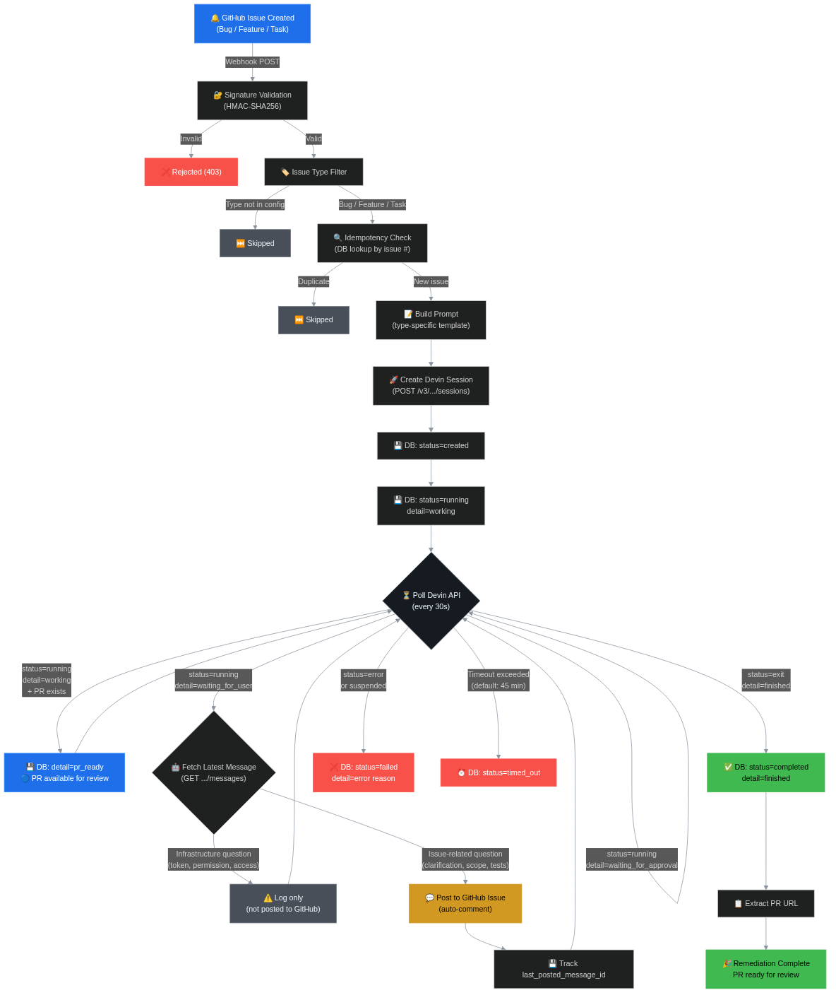
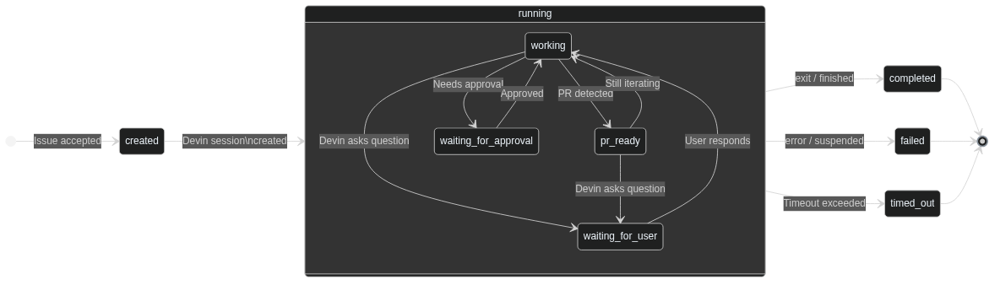

# Product Requirements Document
## Event-Driven Issue Remediation System
**Author:** Anand Rai
**Version:** 1.3
**Date:** April 2026
**Status:** Draft

---

## 1. Problem Statement

Engineering teams at scale face a growing and unmanageable backlog of issues — bugs, feature requests, and maintenance tasks. Manual remediation is slow, inconsistent, and expensive — it requires engineers to context-switch, understand unfamiliar code, write fixes or features, test them, and open pull requests. This process takes hours per issue and weeks at backlog scale.

**The business cost is threefold:**
- Issues remain open while they sit unaddressed in the backlog
- Engineer productivity is degraded by context-switching between issue types
- Delivery velocity drops as backlogs grow faster than teams can address them

**Root cause:** Issue remediation is a well-scoped, repeatable engineering task that is currently dependent on human engineers despite being highly automatable.

---

## 2. Objective

Build a production-grade, event-driven automation system that:
- Detects newly created GitHub issues by their native issue type (Bug, Feature, Task)
- Automatically initiates an AI agent session to analyse and resolve each issue
- Produces auditable, reviewable outputs — pull requests with fixes and tests
- Gives engineering leadership real-time visibility into system health and effectiveness
- Scales across repositories and organisations without linear growth in engineering effort

---

## 3. Target Users

| User | Role | Primary Need |
|---|---|---|
| VP of Engineering | Economic buyer | Reduce issue backlog without consuming engineer time. Measurable velocity improvement. |
| Senior Engineers | Technical reviewers | Trust that AI-generated fixes are correct, well-tested, and follow team conventions before merging |
| Product / Project Managers | Stakeholders | Audit trail showing every issue was identified, assigned, actioned, and resolved with timestamps |
| DevOps / Platform Engineering | Operators | System runs reliably, is observable, integrates with existing toolchain, and fails gracefully |

---

## 4. Scope

### In Scope — Version 1.3
- Webhook listener triggered by GitHub issue creation, filtered by native issue type (default: `Bug`, `Feature`, `Task`)
- Support for all standard GitHub issue types via the `issue.type` field in webhook payloads
- AI agent session manager — creates, monitors, and tracks remediation sessions via Devin API v3
- Idempotent session handling — prevents duplicate remediations for the same issue
- **Granular status tracking** — dashboard shows Devin session sub-states (`working`, `waiting_for_user`, `waiting_for_approval`, `pr_ready`, `finished`)
- **Auto-post Devin questions to GitHub issues** — when Devin is waiting for user input on an issue-related question, the question is automatically posted as a comment on the GitHub issue
- **Infrastructure vs issue-related classification** — infrastructure questions (permissions, tokens, access) are filtered out and NOT posted to GitHub
- Observability layer — logs session lifecycle, PR output, success/failure signals, time-to-remediation
- Operational dashboard — real-time view of system health, remediation throughput, and Devin session links
- Docker containerisation for reproducible, portable deployment
- GitHub Actions CI pipeline (lint, test, Docker build)

### Out of Scope — Future Phases
- Automatic vulnerability scanning (Snyk, Dependabot, SAST tool integration)
- Multi-repository support
- Slack / PagerDuty / email notifications
- Cost-per-remediation tracking
- AI-based severity triage before triggering remediation
- Auto-merge of approved PRs
- JIRA / Linear issue tracker integration

---

## 5. System Architecture

```
┌─────────────────────────────────────────────────────────┐
│                   GitHub Repository                      │
│  Issue created with type: Bug / Feature / Task            │
└─────────────────────────┬───────────────────────────────┘
                          │ Webhook POST
                          ▼
┌─────────────────────────────────────────────────────────┐
│              Webhook Listener Service                    │
│  • Validates GitHub webhook signature (HMAC-SHA256)      │
│  • Filters by GitHub issue type (Bug/Feature/Task)        │
│  • Returns 200 immediately                               │
│  • Enqueues remediation job asynchronously               │
└─────────────────────────┬───────────────────────────────┘
                          │
                          ▼
┌─────────────────────────────────────────────────────────┐
│              Remediation Orchestrator                    │
│  • Checks idempotency — skip if session already exists   │
│  • Builds structured prompt from issue context           │
│  • Calls Devin API v3 to create session                  │
│  • Polls session status until terminal state             │
│  • Extracts PR URL from completed session                │
│  • Handles failures gracefully with retry logic          │
└──────────────┬──────────────────────┬───────────────────┘
               │                      │
               ▼                      ▼
┌──────────────────────┐   ┌──────────────────────────────┐
│     Devin API v3     │   │      Observability Store      │
│   (External)         │   │  • SQLite session log         │
│                      │   │  • Lifecycle timestamps        │
│  Analyses issue      │   │  • Status transitions         │
│  Writes fix          │   │  • PR URLs                    │
│  Opens PR in repo    │   │  • Error messages             │
│                      │   │  • Time-to-remediation        │
└──────────────────────┘   └──────────────┬───────────────┘
                                          │
                                          ▼
                           ┌──────────────────────────────┐
                           │     Operations Dashboard      │
                           │  • Active / completed / failed│
                           │  • Session list with PR links │
                           │  • Success rate               │
                           │  • Average time-to-remediation│
                           │  • Granular status detail     │
                           │  • Devin session links        │
                           │  • Auto-refresh               │
                           └──────────────────────────────┘

                           ┌──────────────────────────────┐
                           │   GitHub Issue Auto-Comment   │
                           │  • Fetch Devin messages (v3)  │
                           │  • Classify: infra vs issue   │
                           │  • Post issue questions back  │
                           │  • De-duplicate via event_id  │
                           └──────────────────────────────┘
```

---

## 5.1 Issue Resolution Workflow (DAG)

The end-to-end issue resolution process can be represented as a directed acyclic graph. Each node represents a processing step; edges represent transitions triggered by events or conditions.



**Workflow stages:**

1. **Ingestion** — GitHub webhook delivers the issue event; the system validates the signature, filters by issue type, and checks for duplicate sessions.
2. **Prompt Construction** — A type-specific prompt (Bug → `fix:`, Feature → `feat:`, Task → `chore:`) is built from the issue context.
3. **Session Creation** — Devin API v3 session is created; DB record transitions from `created` → `running/working`.
4. **Polling Loop** — The orchestrator polls Devin every 30 seconds. Sub-states are tracked:
   - `working` → actively coding
   - `pr_ready` → PR exists, still iterating (e.g., tests, CI)
   - `waiting_for_user` → Devin has a question → auto-post to GitHub if issue-related
   - `waiting_for_approval` → needs human approval
5. **Terminal States** — Session reaches `completed` (exit/finished), `failed` (error/suspended), or `timed_out`.

## 5.2 Session State Lifecycle

The session status machine shows all valid state transitions:



**State transitions:**

| From | To | Trigger |
|---|---|---|
| `[start]` | `created` | Issue accepted by webhook |
| `created` | `running` | Devin API session created |
| `running/working` | `running/pr_ready` | PR URL detected in session data |
| `running/working` | `running/waiting_for_user` | Devin asks a question |
| `running/working` | `running/waiting_for_approval` | Devin needs approval |
| `running/waiting_for_user` | `running/working` | User responds to question |
| `running/pr_ready` | `running/waiting_for_user` | Devin asks a question after PR creation |
| `running/*` | `completed` | Devin reports `exit` / `finished` |
| `running/*` | `failed` | Devin reports `error` / `suspended` |
| `running/*` | `timed_out` | Session exceeds configured timeout |

> **Mermaid source files:** `docs/workflow.mmd` and `docs/state-lifecycle.mmd` can be edited and re-rendered with `npx @mermaid-js/mermaid-cli`.

---

## 6. Functional Requirements

### 6.1 Webhook Listener

| ID | Requirement | Priority |
|---|---|---|
| WH-01 | Accept POST requests on `/webhook` endpoint | Must Have |
| WH-02 | Validate GitHub webhook signature using HMAC-SHA256 and shared secret | Must Have |
| WH-03 | Return HTTP 200 immediately before processing — webhook delivery must not time out | Must Have |
| WH-04 | Filter events — only process `issues.opened` or `issues.labeled` events | Must Have |
| WH-05 | Only trigger remediation for issues whose `type.name` matches a configured issue type | Must Have |
| WH-06 | Process remediation jobs asynchronously — decouple from HTTP response | Must Have |
| WH-07 | Handle malformed payloads gracefully — log and discard without crashing | Must Have |
| WH-08 | Support configurable issue type list via `ISSUE_TYPES` environment variable (default: `bug,feature,task`) | Should Have |

---

### 6.2 Remediation Orchestrator

| ID | Requirement | Priority |
|---|---|---|
| RO-01 | Check idempotency before creating a session — if a session already exists for this issue number, skip | Must Have |
| RO-02 | Build structured prompt from issue context: repository URL, issue number, title, body | Must Have |
| RO-03 | Call Devin API v3 to create a new remediation session (`POST /v3/organizations/{org_id}/sessions`) | Must Have |
| RO-04 | Idempotency handled at the application level via DB check (v3 does not expose an idempotent flag) | Must Have |
| RO-05 | Poll session status at configurable interval (default: 30 seconds) until terminal state | Must Have |
| RO-06 | Extract pull request URL from completed session output | Must Have |
| RO-07 | Handle session failure — log error details, do not retry automatically in v1.0 | Must Have |
| RO-08 | Implement session timeout — mark as failed if session exceeds configurable limit (default: 45 minutes) | Must Have |
| RO-09 | Log all state transitions with timestamps | Must Have |
| RO-10 | Support configurable polling interval via environment variable | Should Have |
| RO-11 | Support configurable session timeout via environment variable | Should Have |
|| RO-12 | Track granular `status_detail` from Devin API v3 in DB (working, waiting_for_user, waiting_for_approval, finished) | Must Have |
|| RO-13 | When `status_detail` is `waiting_for_user`, fetch the latest Devin message via the v3 messages API | Must Have |
|| RO-14 | Classify Devin messages as infrastructure vs issue-related using keyword matching | Must Have |
|| RO-15 | Post issue-related questions to the GitHub issue as a comment, with a link to the Devin session | Must Have |
|| RO-16 | Track `last_posted_message_id` to prevent duplicate comments for the same message | Must Have |
|| RO-17 | Set `status_detail` to `pr_ready` when a PR exists but Devin is still actively working | Should Have |

---

### 6.3 Devin Prompt Design

The quality of remediation depends directly on prompt quality. Each issue type uses a **distinct prompt template** modelled on the [Devin prompt templates cheat sheet](https://docs.devin.ai/essential-guidelines/prompt-templates-cheat-sheet). This ensures Devin receives the right structure and instructions for each type of work.

#### Bug Prompt Template

```
Fix the bug described in issue #{issue_number} in the repository below.

Repository: {repo_url}
Branch: main
Issue: #{issue_number} — {issue_title}

Bug description:
{issue_body}

Please:
1. Investigate the root cause of the bug
2. Implement a fix that addresses the root cause — not just the symptom
3. Add a regression test to prevent this issue from recurring
4. Run the existing test suite to ensure no regressions
5. Open a pull request with:
   - Title: "fix: {issue_title} (closes #{issue_number})"
   - Body: explanation of root cause, what was changed, and why
   - Reference to Issue #{issue_number}

Scope: Do not make changes beyond what is required to fix this bug.
```

#### Feature Prompt Template

```
Implement the feature described in issue #{issue_number} in the repository below.

Repository: {repo_url}
Branch: main
Issue: #{issue_number} — {issue_title}

Feature requirements:
{issue_body}

Please:
1. Review the existing codebase for related patterns and conventions
2. Implement the feature following the project's existing conventions
3. Add input validation and error handling where appropriate
4. Write unit tests for the new functionality
5. Run the existing test suite to ensure no regressions
6. Update documentation if applicable
7. Open a pull request with:
   - Title: "feat: {issue_title} (closes #{issue_number})"
   - Body: explanation of the implementation approach and any design decisions
   - Reference to Issue #{issue_number}

Scope: Do not make changes beyond what is required to implement this feature.
```

#### Task Prompt Template

```
Complete the task described in issue #{issue_number} in the repository below.

Repository: {repo_url}
Branch: main
Issue: #{issue_number} — {issue_title}

Task description:
{issue_body}

Please:
1. Analyse the current implementation and understand what needs to change
2. Implement the changes following the project's existing patterns and conventions
3. Keep all existing functionality intact
4. Ensure all existing tests still pass
5. Add tests for any new functions or changed behaviour
6. Open a pull request with:
   - Title: "chore: {issue_title} (closes #{issue_number})"
   - Body: explanation of what was changed and why
   - Reference to Issue #{issue_number}

Scope: Do not make changes beyond what is required to complete this task.
```

**Issue type to PR prefix mapping:**
| Issue Type | PR Prefix | Prompt Focus |
|---|---|---|
| `Bug` | `fix:` | Root cause analysis, regression testing |
| `Feature` | `feat:` | Pattern adherence, validation, documentation |
| `Task` | `chore:` | Convention following, preserving existing functionality |

| ID | Requirement | Priority |
|---|---|---|
| PR-01 | Prompt must include repository URL, issue number, title, and full body | Must Have |
| PR-02 | Prompt must instruct Devin to open a PR referencing the issue | Must Have |
| PR-03 | Prompt must constrain scope — fixes only, no unrelated changes | Must Have |
| PR-04 | Prompt must require test coverage for the fix | Must Have |
| PR-05 | Prompt template must be configurable via environment or config file | Should Have |
| PR-06 | Each issue type must use a distinct prompt template following the Devin cheat sheet | Must Have |

---

### 6.4 Observability Store

| ID | Requirement | Priority |
|---|---|---|
| OB-01 | Persist all session records to SQLite database | Must Have |
| OB-02 | Store: session_id, issue_number, issue_title, status, created_at, updated_at, completed_at | Must Have |
| OB-03 | Store PR URL on successful session completion | Must Have |
| OB-04 | Store error message and error type on session failure | Must Have |
| OB-05 | Calculate and store time_to_remediation_seconds on completion | Must Have |
| OB-06 | Support status values: `created`, `running`, `completed`, `failed`, `timed_out` | Must Have |
| OB-07 | Database must persist across container restarts via volume mount | Must Have |
|| OB-08 | Store `status_detail` for granular sub-state tracking (working, waiting_for_user, waiting_for_approval, pr_ready, finished) | Must Have |
|| OB-09 | Store `devin_url` for direct links to Devin sessions | Should Have |
|| OB-10 | Store `last_posted_message_id` to de-duplicate auto-posted GitHub comments | Must Have |

**Schema:**
```sql
CREATE TABLE sessions (
    id                          INTEGER PRIMARY KEY AUTOINCREMENT,
    session_id                  TEXT UNIQUE NOT NULL,
    issue_number                INTEGER NOT NULL,
    issue_title                 TEXT NOT NULL,
    repository_url              TEXT NOT NULL,
    status                      TEXT NOT NULL,
    status_detail               TEXT,
    devin_url                   TEXT,
    pr_url                      TEXT,
    error_message               TEXT,
    error_type                  TEXT,
    last_posted_message_id      TEXT,
    created_at                  TIMESTAMP DEFAULT CURRENT_TIMESTAMP,
    updated_at                  TIMESTAMP DEFAULT CURRENT_TIMESTAMP,
    completed_at                TIMESTAMP,
    time_to_remediation_seconds INTEGER
);

CREATE INDEX idx_issue_number ON sessions(issue_number);
CREATE INDEX idx_status ON sessions(status);
```

**Status Detail Values:**
| `status_detail` | Meaning | Displayed On Dashboard |
|---|---|---|
| `working` | Devin is actively coding | Green text |
| `waiting_for_user` | Devin has a question for the user | Yellow/amber text |
| `waiting_for_approval` | Devin needs approval to proceed | Yellow/amber text |
| `pr_ready` | A PR exists but Devin is still working (e.g., running tests, fixing CI) | Blue bold text |
| `finished` | Devin has completed the task | Set on terminal "completed" status |

---

### 6.5 Operations Dashboard

| ID | Requirement | Priority |
|---|---|---|
| DB-01 | Display count of sessions by status: active, completed, failed | Must Have |
| DB-02 | Display overall success rate as percentage | Must Have |
| DB-03 | Display average time-to-remediation across all completed sessions | Must Have |
| DB-04 | List all sessions with: issue number, title, status, status detail, PR link, Devin session link, created time | Must Have |
| DB-05 | PR links must be clickable — open in new tab | Must Have |
| DB-06 | Dashboard accessible at `/dashboard` | Must Have |
| DB-07 | Auto-refresh every 30 seconds | Should Have |
| DB-08 | Filter sessions by status | Should Have |
| DB-09 | Show session timeline — time spent in each status | Could Have |
|| DB-10 | Display granular `status_detail` below the main status badge with colour-coded styling | Must Have |
|| DB-11 | Show Devin session links for quick access to the AI agent interface | Should Have |

---

## 7. Non-Functional Requirements

### 7.1 Reliability

| ID | Requirement |
|---|---|
| NF-01 | Webhook listener must return 200 within 2 seconds regardless of downstream processing time |
| NF-02 | System must handle Devin API unavailability gracefully — queue jobs for retry |
| NF-03 | System must handle GitHub API rate limiting — implement exponential backoff |
| NF-04 | No data loss on container restart — all state persisted to durable storage |

### 7.2 Idempotency

| ID | Requirement |
|---|---|
| NF-05 | Processing the same issue event twice must not create duplicate Devin sessions |
| NF-06 | Restarting the container must not re-trigger already-completed remediations |

### 7.3 Security

| ID | Requirement |
|---|---|
| NF-07 | GitHub webhook signature must be validated on every request |
| NF-08 | API keys must be injected via environment variables — never hardcoded |
| NF-09 | No API keys or secrets must appear in logs |

### 7.4 Observability

| ID | Requirement |
|---|---|
| NF-10 | Every state transition must be logged with timestamp and session ID |
| NF-11 | Structured logs must include: timestamp, level, session_id, issue_number, event_type, message |
| NF-12 | Errors must include full stack trace in logs |

### 7.5 Portability

| ID | Requirement |
|---|---|
| NF-13 | Full system must start via `docker-compose up` with no manual steps beyond providing API keys |
| NF-14 | All configuration must be injectable via environment variables |
| NF-15 | README must enable a new engineer to run the system in under 10 minutes |

---

## 8. Configuration Reference

All configuration injected via environment variables:

| Variable | Description | Default | Required |
|---|---|---|---|
| `GITHUB_WEBHOOK_SECRET` | Shared secret for webhook signature validation | — | Yes |
| `DEVIN_API_KEY` | Devin API key (service user, `cog_` prefix) | — | Yes |
| `DEVIN_ORG_ID` | Devin organisation ID (Settings → Service Users) | — | Yes |
| `GITHUB_TOKEN` | GitHub personal access token for PR operations | — | Yes |
| `REPOSITORY_URL` | Target GitHub repository URL | — | Yes |
| `ISSUE_TYPES` | Comma-separated list of GitHub issue types that trigger remediation | `bug,feature,task` | No |
| `POLLING_INTERVAL_SECONDS` | How often to poll Devin session status | `30` | No |
| `SESSION_TIMEOUT_MINUTES` | Max session duration before marking timed out | `45` | No |
| `DATABASE_PATH` | Path to SQLite database file | `/data/sessions.db` | No |
| `DASHBOARD_PORT` | Port for operations dashboard | `5000` | No |

---

## 9. Tech Stack

| Component | Technology | Rationale |
|---|---|---|
| Webhook listener | Python + Flask | Lightweight, fast to build, production-proven for webhook handling |
| Async processing | Python threading / queue | Decouples webhook response from processing without complex infrastructure |
| Session manager | Python + requests | Clean HTTP client for Devin API v3 calls |
| Observability store | SQLite | Zero-dependency, sufficient for single-repository scale, durable |
| Dashboard | Flask + Jinja2 | Simple server-rendered HTML, no frontend build step required |
| Containerisation | Docker + docker-compose | Reproducible, portable, single-command deployment |

---

## 10. Success Criteria

The system is considered production-ready when:

| Criteria | Measurement |
|---|---|
| Event triggering | A GitHub issue with type `Bug`, `Feature`, or `Task` triggers a Devin session within 60 seconds — without manual intervention |
| Remediation quality | Devin successfully opens a pull request with a fix and tests in ≥ 70% of triggered sessions |
| Idempotency | Creating the same issue twice does not create duplicate sessions |
| Observability | Dashboard accurately reflects all session states and PR outcomes in real time |
| Portability | System starts cleanly via `docker-compose up` on a fresh machine with only API keys provided |
| Reliability | System recovers from container restart without data loss or duplicate processing |

---

## 11. Future Roadmap

| Phase | Feature | Value |
|---|---|---|
| v1.1 | Automatic vulnerability scanning integration (Snyk, Dependabot) | Removes manual issue creation — fully autonomous pipeline |
| v1.2 | AI-based severity triage — classify issues before triggering Devin | Prioritise critical vulnerabilities, skip low-risk issues |
| v1.3 | Slack / PagerDuty notifications on completion and failure | Operational awareness without checking dashboard |
| v1.4 | Multi-repository support | Scale across an organisation's full GitHub footprint |
| v1.5 | Cost-per-remediation tracking | Build ROI case for engineering leadership |
| v2.0 | Auto-merge approved PRs with passing CI | Fully autonomous remediation pipeline — zero human touchpoints for low-risk fixes |

---

*PRD Version 1.3 — Anand Rai — April 2026*

---

## Changelog

### v1.3 (April 2026)
- **Issue resolution workflow diagram (DAG)**: Added visual diagram (`docs/workflow-diagram.png`) showing the full end-to-end issue resolution process as a directed acyclic graph
- **Session state lifecycle diagram**: Added state machine diagram (`docs/state-lifecycle.png`) showing all valid session state transitions
- **Mermaid source files**: `docs/workflow.mmd` and `docs/state-lifecycle.mmd` for editable diagram sources
- **Granular status tracking**: Dashboard now shows `status_detail` from the Devin API v3 (working, waiting_for_user, waiting_for_approval) alongside the main status badge, with colour-coded styling
- **`pr_ready` sub-status**: When a PR exists but Devin is still working (e.g., running tests), the dashboard shows `pr_ready` in blue bold text — giving reviewers a signal that the PR is available
- **Auto-post Devin questions to GitHub issues**: When Devin is `waiting_for_user` and the question is about the issue (not infrastructure), the question is automatically posted as a comment on the GitHub issue with a link to the Devin session
- **Infrastructure vs issue-related classification**: Messages containing keywords like `permission`, `token`, `API key`, `contents:write`, `push access` are classified as infrastructure and NOT posted to GitHub
- **De-duplication**: `last_posted_message_id` tracks the last posted message to prevent duplicate comments
- **New DB columns**: `status_detail`, `devin_url`, `last_posted_message_id` added to sessions table (migration is idempotent)
- **Devin session links**: Dashboard includes direct links to Devin sessions for quick access
- **New requirements**: RO-12 through RO-17, OB-08 through OB-10, DB-10, DB-11

### v1.2 (April 2026)
- **Devin API v3 migration**: All API calls now use Devin API v3 (`/v3/organizations/{org_id}/sessions`). v1/v2 endpoints are no longer used.
- **New required config `DEVIN_ORG_ID`**: Organisation ID is now required for all Devin API calls (find it at Settings → Service Users)
- **Updated session response handling**: v3 returns `status`/`status_detail` (replacing `status_enum`) and `pull_requests` array (replacing single `pull_request` object)
- **Updated terminal statuses**: Session completion is now `status=exit, status_detail=finished`; failure states are `error` and `suspended`
- **Application-level idempotency**: v3 does not expose an `idempotent` flag; duplicate prevention handled entirely via DB check

### v1.1 (April 2026)
- **Issue type filtering**: System now filters by GitHub's native issue type field (`issue.type.name`) instead of labels. Supports `Bug`, `Feature`, and `Task`.
- **Replaced `VULNERABILITY_LABEL`** with `ISSUE_TYPES` environment variable (comma-separated list of type names)
- **Type-specific prompt templates**: Each issue type (Bug, Feature, Task) uses a distinct prompt template modelled on the [Devin prompt templates cheat sheet](https://docs.devin.ai/essential-guidelines/prompt-templates-cheat-sheet), with type-appropriate instructions and conventional commit prefixes (`fix:`, `feat:`, `chore:`)
- **GitHub Actions CI**: Added lint (ruff), test (pytest), and Docker build jobs
- **Updated PRD to v1.1** reflecting expanded scope

### v1.0 (April 2026)
- Initial release — vulnerability-only label filtering
